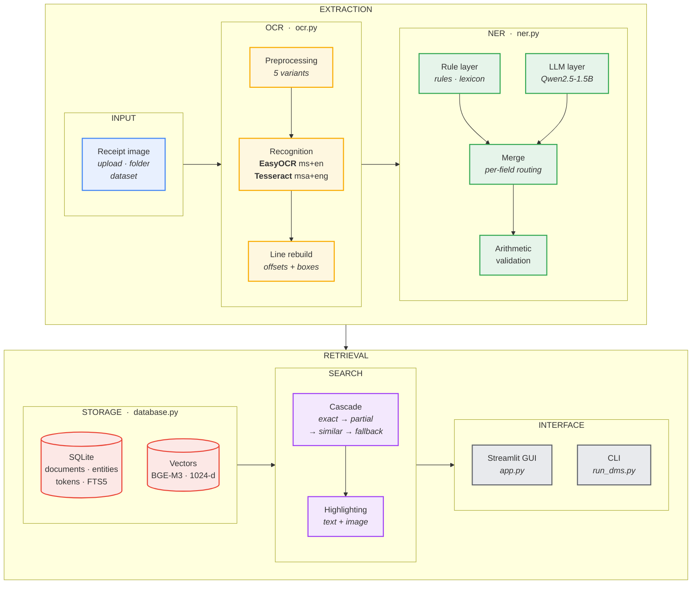
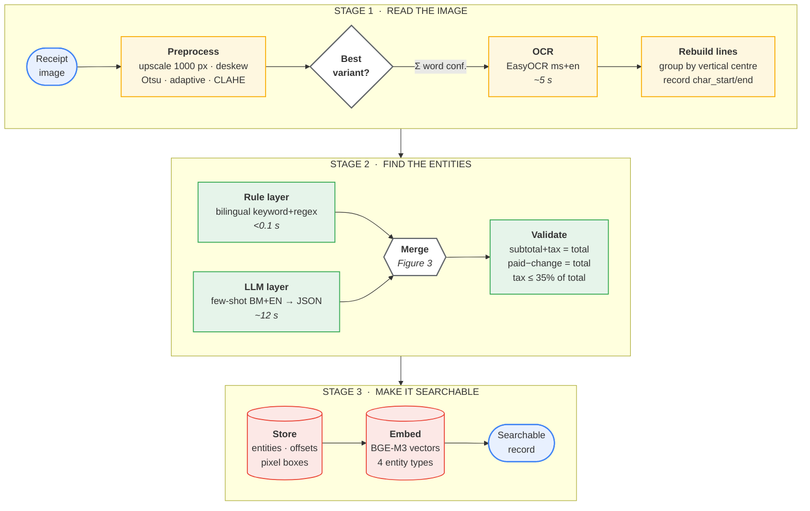
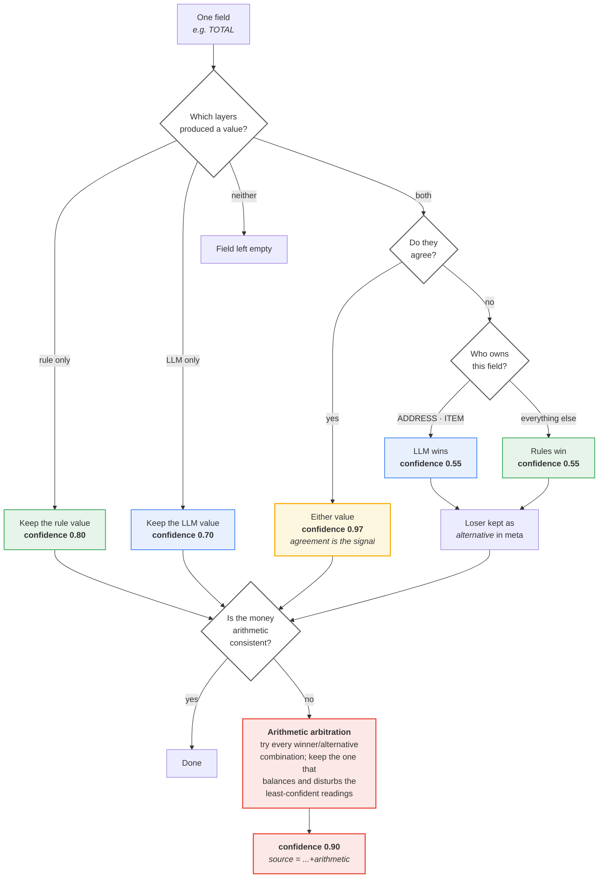
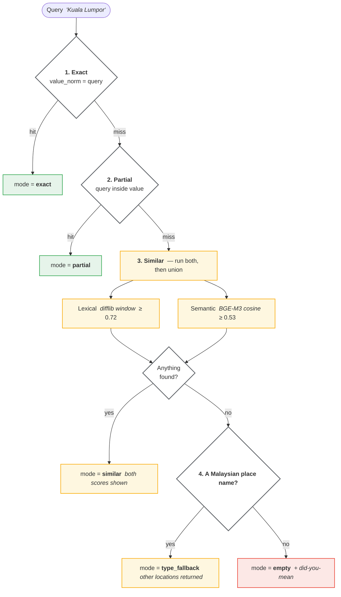

# System diagrams

Source for the figures in the Methodology section of the report.

Each diagram exists in two forms:

* **Mermaid** — the source below. GitHub renders it automatically.
* **PNG** — `docs/diagrams/*.png`, for pasting into Word.

The Mermaid text is the master copy. If a diagram needs changing, edit it here
and re-export, so the two never drift apart.

---

## Figure 1 — System architecture

The system in layers. Each layer depends only on the one above it, which is why
the language model can be switched off entirely and the rest still runs.



---

## Figure 2 — Processing pipeline

What happens to one receipt, from image file to searchable record.
Timings are for the default configuration on an RTX 4060.



---

## Figure 3 — Hybrid merge and arbitration

**This is the core contribution.** It runs once per field. The two layers are
never averaged; one of them wins, and the reason it won is recorded.



**Why agreement means something.** The two layers fail in unrelated ways — the
rules break on layout, the model drifts on digits. When two independent methods
that fail differently produce the same answer, that answer is very likely right.
That is the whole justification for the 0.97.

---

## Figure 4 — Search cascade

Each strategy is tried in turn; the first that returns anything wins, and the
mode is reported so a result set can explain itself. The requirement that
*"related documents are returned when the query is absent"* is satisfied by the
last two stages.



---

## Regenerating the PNGs

```bash
python tools/render_diagrams.py
```

Opens each Mermaid block in a headless browser, renders it and writes
`docs/diagrams/figure1.png` … `figure4.png`.
